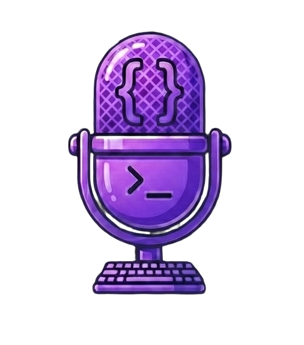

# LeetSpeak 🎤

**Real interviews aren't silent. Learn to speak your code.**

LeetSpeak is an AI-powered coding practice platform that helps developers prepare for technical interviews by practicing articulating their thought process out loud. Just like in real interviews, you'll explain your approach before coding while receiving real-time, conversational guidance from an AI coach.



## 🎯 Problem

- LeetCode is fundamental to tech interviews, but most practice happens in silence
- When forced to speak and think simultaneously during interviews, many candidates freeze up
- Traditional coding practice doesn't prepare you for the verbal communication aspect of interviews

## ✨ Solution

LeetSpeak bridges this gap by:

- **Voice-driven practice**: Speak your thought process while solving problems
- **Real-time AI coaching**: Receive instant, Socratic feedback without spoiling the solution
- **Progressive unlocking**: Code editing is enabled only after you've articulated the optimal approach
- **Multi-language support**: Practice with JavaScript and C++ (with more languages coming)

## 🚀 Features

- 🎤 **Voice Recognition**: Uses Web Speech API to capture your spoken thoughts
- 🤖 **AI Coaching**: Google Gemini API provides intelligent, conversational guidance
- 🔊 **Text-to-Speech**: Inworld AI (with browser fallback) speaks feedback naturally
- 💻 **Monaco Editor**: Full-featured code editor (same as VS Code) for implementation
- 🧪 **Test Runner**: Run your code against test cases with instant feedback
- 💬 **Chat Assistant**: Ask quick questions about syntax and patterns
- 📊 **Progress Tracking**: Visual progress bar shows how close you are to the solution
- 🎯 **Step-by-step Hints**: Progressive hints system to guide without giving answers

## 🛠️ Tech Stack

### Frontend
- **React 19** - UI framework
- **Vite** - Build tool and dev server
- **TailwindCSS** - Styling
- **React Router** - Navigation
- **Monaco Editor** - Code editor component
- **Lucide React** - Icons

### AI & Speech
- **Google Gemini API** - AI coaching and code analysis
- **Web Speech API** - Speech recognition (browser-native)
- **Inworld AI API** - Natural text-to-speech (with browser fallback)

### Backend
- **Node.js/Express** - C++ compilation server
- **g++** - C++ compiler (required for C++ support)

### Deployment
- **Netlify** - Frontend hosting
- **Netlify Functions** - Serverless backend support

## 📋 Prerequisites

- **Node.js** (v18 or higher)
- **npm** or **yarn**
- **g++** compiler (optional, only needed for C++ support)
  - macOS: `brew install gcc`
  - Ubuntu/Debian: `sudo apt-get install g++`
  - Windows: Install [MinGW](https://www.mingw-w64.org/)

## 🚀 Getting Started

### 1. Clone the Repository

```bash
git clone <repository-url>
cd LeetSpeak
```

### 2. Install Frontend Dependencies

```bash
npm install
```

### 3. Install Backend Dependencies

```bash
cd server
npm install
cd ..
```

### 4. Set Up Environment Variables

Create a `.env` file in the root directory:

```env
# Required: Google Gemini API Key
# Get yours at: https://makersuite.google.com/app/apikey
VITE_GEMINI_API_KEY=your_gemini_api_key_here

# Optional: Inworld AI API Key (for better TTS)
# Get yours at: https://studio.inworld.ai/
VITE_INWORLD_API_KEY=your_inworld_api_key_here
VITE_INWORLD_VOICE_ID=Timothy  # Or any Inworld voice name
```

**Note**: The app will work with just the Gemini API key. Inworld AI is optional and provides better text-to-speech quality. If not provided, the browser's native speech synthesis will be used.

### 5. Start the Development Servers

**Terminal 1 - Frontend:**
```bash
npm run dev
```

**Terminal 2 - Backend (for C++ support):**
```bash
cd server
npm start
```

The frontend will be available at `http://localhost:5173` (or the port Vite assigns).

The backend server runs on `http://localhost:3001` by default.

### 6. Access the Application

Open your browser and navigate to `http://localhost:5173`.

**Important**: Use Chrome, Edge, or Safari for full voice recognition support. Firefox has limited Web Speech API support.

## 📁 Project Structure

```
LeetSpeak/
├── src/
│   ├── pages/
│   │   ├── App.jsx           # Main app router
│   │   ├── Home.jsx          # Landing page
│   │   ├── ListPage.jsx      # Problem list
│   │   └── Practice.jsx      # Practice interface
│   ├── problems/             # Problem definitions (JSON)
│   │   ├── two-sum.json
│   │   ├── contains-duplicate.json
│   │   └── ...
│   └── utils/
│       ├── gemini.js         # Gemini API integration
│       └── inworld.js        # Inworld TTS integration
├── server/
│   ├── index.js              # Express server for C++ compilation
│   └── temp/                 # Temporary compiled files
├── public/                   # Static assets
└── package.json
```

## 🎮 How to Use

### 1. Choose a Problem
Navigate to the problem list and select a LeetCode problem to practice.

### 2. Voice Phase
- Click **"Start mic"** to begin voice recognition
- Speak your approach and thought process out loud
- The AI coach listens and provides real-time feedback
- Continue until you articulate the optimal approach

### 3. Coding Phase
- Once you've identified the optimal approach, code editing unlocks automatically
- Implement your solution in the Monaco editor
- Use JavaScript or C++ (Python support coming soon)
- The AI continues to monitor your code and provide hints

### 4. Test Your Solution
- Click **"Run"** to execute your code against test cases
- View results in the console output
- Iterate based on feedback and test results

### 5. Get Help
- Use the **Chat** tab to ask quick questions about syntax or patterns
- Reveal **Hints** progressively if you're stuck
- View the **Solution** only as a last resort

## 🧪 Adding New Problems

Problems are stored as JSON files in `src/problems/`. Each problem file should follow this structure:

```json
{
  "id": "problem-id",
  "title": "Problem Title",
  "difficulty": "Easy|Medium|Hard",
  "topic": "Array|String|...",
  "prompt": "Problem description...",
  "examples": [
    { "input": "...", "output": "..." }
  ],
  "constraints": ["constraint 1", "constraint 2"],
  "jsStarter": "function solution() { ... }",
  "cppStarter": "class Solution { ... }",
  "tests": [
    { "name": "Test 1", "input": [...], "expected": ... }
  ],
  "hints": ["hint 1", "hint 2"],
  "solution": {
    "javascript": "...",
    "cpp": "..."
  }
}
```

After adding a problem JSON file, add it to the `questions` array in `src/pages/ListPage.jsx`.

## 🔧 Configuration

### Changing the Gemini Model

Edit `src/utils/gemini.js`:

```javascript
const GEMINI_MODEL = 'gemini-2.5-pro'; // or 'gemini-2.5-flash' for faster responses
```

### Changing the Voice

Edit `src/utils/inworld.js` or set in `.env`:

```javascript
const INWORLD_VOICE_ID = "Nova"; // Options: Ronald, Nova, Adam, Ashley, etc.
```

### Backend Port

Set the `PORT` environment variable in the `server/` directory or edit `server/index.js`:

```javascript
const PORT = process.env.PORT || 3001;
```

## 🚢 Deployment

### Frontend (Netlify)

1. Build the project:
   ```bash
   npm run build
   ```

2. Deploy to Netlify:
   - Connect your repository to Netlify
   - Set build command: `npm run build`
   - Set publish directory: `dist`
   - Add environment variables in Netlify dashboard

### Backend (Optional)

The backend is only needed for C++ compilation. You can:
- Deploy as a separate service (Heroku, Railway, etc.)
- Use Netlify Functions (requires configuration)
- Run locally if C++ support isn't needed

## 🌐 Browser Compatibility

| Feature | Chrome | Edge | Safari | Firefox |
|---------|--------|------|--------|---------|
| Voice Recognition | ✅ | ✅ | ✅ | ⚠️ Limited |
| Text-to-Speech | ✅ | ✅ | ✅ | ✅ |
| Monaco Editor | ✅ | ✅ | ✅ | ✅ |

**Recommendation**: Use Chrome, Edge, or Safari for the best experience.

## 🤝 Contributing

Contributions are welcome! Feel free to:
- Add new LeetCode problems
- Improve the AI coaching prompts
- Enhance the UI/UX
- Add support for more languages
- Report bugs or suggest features

## 📝 License

This project is open source and available under the [MIT License](LICENSE).

## 🙏 Acknowledgments

- **LeetCode** - For problem inspiration
- **Google Gemini** - AI coaching capabilities
- **Inworld AI** - Natural text-to-speech
- **Monaco Editor** - Powerful code editing experience

## 📧 Contact

For questions or feedback, please open an issue on GitHub.

---

**Happy practicing! Remember: In real interviews, communication is just as important as coding. LeetSpeak helps you master both.** 🚀